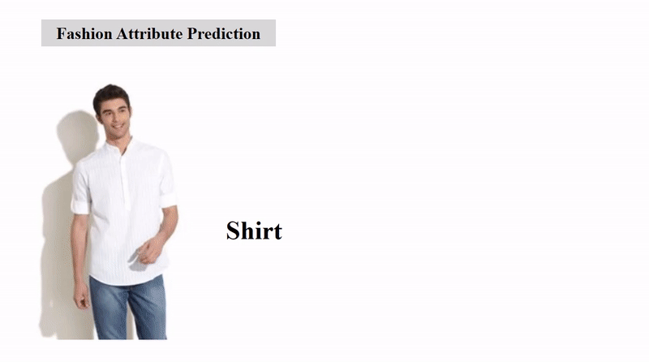
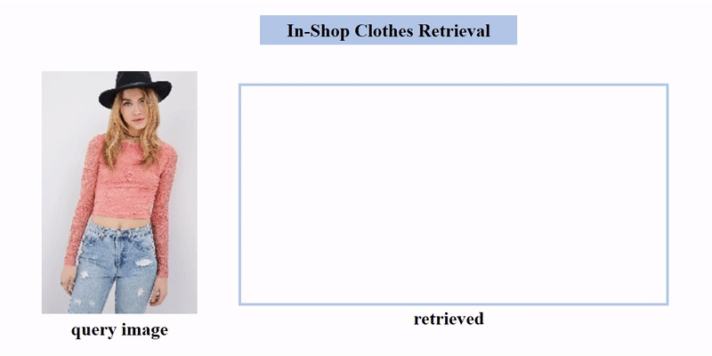
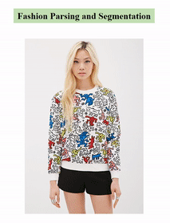
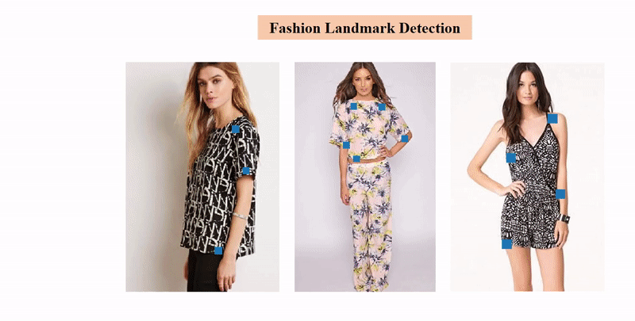
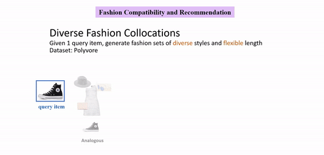

# MMFashion

<p align="center">
    
</p>


## Introduction

[[Technical Report]](https://arxiv.org/abs/2005.08847)

`MMFashion` is an open source visual fashion analysis toolbox based on [PyTorch](https://pytorch.org/). It is a part of the [open-mmlab](https://github.com/open-mmlab) project developed by [Multimedia Lab, CUHK](http://mmlab.ie.cuhk.edu.hk/).


## Updates

[2019-11-01] `MMFashion` v0.1 is released.

[2020-02-14] `MMFashion` v0.2 is released, adding consumer-to-shop retrieval module.

[2020-04-27] `MMFashion` v0.3 is released, adding fashion segmentation and parsing module.

[2020-05-04] `MMFashion` v0.4 is released, adding fashion compatibility and recommendation module.

[2020-12-08] `MMFashion` v0.5 is released, adding virtual try-on module.

<p align="left">
    
    
    
    
    
    
</p>


## Features

- **Flexible:** modular design and easy to extend
- **Friendly:** off-the-shelf models for layman users
- **Comprehensive:** support a wide spectrum of fashion analysis tasks

    - [x] Fashion Attribute Prediction
    - [x] Fashion Recognition and Retrieval
    - [x] Fashion Landmark Detection
    - [x] Fashion Parsing and Segmentation
    - [x] Fashion Compatibility and Recommendation
    - [x] Fashion Virtual Try-On


## Requirements

- [Python 3.5+](https://www.python.org/)
- [PyTorch 1.0.0+](https://pytorch.org/)
- [mmcv](https://github.com/open-mmlab/mmcv)


## Installation

```sh
git clone --recursive https://github.com/open-mmlab/mmfashion.git
cd mmfashion
python setup.py install
```

### Another option: Docker Image

We provide a [Dockerfile](https://github.com/open-mmlab/mmfashion/blob/master/docker/Dockerfile) to build an image.

```sh
# build an image with PyTorch 1.5, CUDA 10.1
docker build -t mmfashion docker/
```

Run it with

```sh
docker run --gpus all --shm-size=8g -it mmfashion
```


## Get Started

Please refer to [GETTING_STARTED.md](docs/GETTING_STARTED.md) for the basic usage of `MMFashion`.


## Data Preparation

Please refer to [DATA_PREPARATION.md](docs/DATA_PREPARATION.md) for the dataset specifics of `MMFashion`.


## Model Zoo

Please refer to [MODEL_ZOO.md](docs/MODEL_ZOO.md) for a comprehensive set of pre-trained models in `MMFashion`.


## Contributing

We appreciate all contributions to improve `MMFashion`. Please refer to [CONTRIBUTING.md](docs/CONTRIBUTING.md) for the contributing guideline.


## Related Tools

- [fashion-detection](https://github.com/liuziwei7/fashion-detection)
- [fashion-landmarks](https://github.com/liuziwei7/fashion-landmarks)
- [fashion-cut](https://github.com/liuziwei7/fashion-cut)


## License

This project is released under the [Apache 2.0 license](LICENSE).


## Team

* Xin Liu ([veralauee](https://github.com/veralauee))
* Jiancheng Li ([lijiancheng0614](https://github.com/lijiancheng0614))
* Jiaqi Wang ([myownskyW7](https://github.com/myownskyW7))
* Ziwei Liu ([liuziwei7](https://github.com/liuziwei7))

## Citation

```
@inproceedings{mmfashion,
  title={MMFashion: An Open-Source Toolbox for Visual Fashion Analysis},
  author={Liu, Xin and Li, Jiancheng and Wang, Jiaqi and Liu, Ziwei},
  booktitle={{ACM Multimedia 2021, Open Source Software Competition},
  year={2021}
}
```
